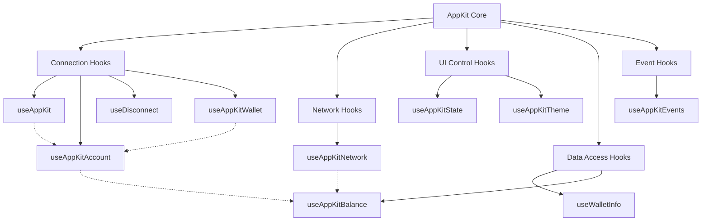

import WagmiHooks from "/snippets/appkit/next/wagmi/hooks.mdx";
import EthersHooks from "/snippets/appkit/next/ethers/hooks.mdx";
import Ethers5Hooks from "/snippets/appkit/next/ethers5/hooks.mdx";
import SolanaHooks from "/snippets/appkit/next/solana/hooks.mdx";
import OpenModal from "/snippets/appkit/next/core/open.mdx";

Hooks are React functions that provide access to wallet connection features, modal controls, blockchain interactions, and wallet event subscriptions. They enable you to manage wallet connections, handle user authentication, interact with smart contracts, and respond to wallet events in your application.

## Hook Ecosystem

AppKit provides a comprehensive set of React hooks that work together to provide a complete wallet connection and blockchain interaction experience. These hooks can be categorized into several functional groups:

- **Connection Hooks**: Manage wallet connections and user authentication (`useAppKit`, `useAppKitAccount`, `useDisconnect`)
- **Network Hooks**: Handle blockchain network selection and information (`useAppKitNetwork`)
- **UI Control Hooks**: Control the modal and UI elements (`useAppKitState`, `useAppKitTheme`)
- **Data Access Hooks**: Access wallet and blockchain data (`useAppKitBalance`, `useWalletInfo`)
- **Event Hooks**: Subscribe to wallet and connection events (`useAppKitEvents`)

The diagram below illustrates how these hooks relate to each other and to the core AppKit functionality:



These hooks provide a modular way to integrate wallet functionality into your application, allowing you to use only the features you need.

## useAppKit

The primary hook for controlling the modal's visibility and behavior. Use this hook when you need to programmatically open or close the modal, or when you want to show specific views like the connection screen or account details.

```ts
import { useAppKit } from "@reown/appkit/react";

export default function Component() {
  const { open, close } = useAppKit();
}
```

### Use Cases
- Opening the modal when a user clicks a "Connect Wallet" button
- Closing the modal after a successful connection
- Opening specific views of the modal (e.g., account view, connect view)
- Handling custom wallet connection flows

### Returns

- `open`: Function to open the modal
- `close`: Function to close the modal

### Parameters

<OpenModal />

## useAppKitAccount

The essential hook for accessing wallet connection state and user information. Use this hook whenever you need to know if a user is connected, get their wallet address, or access their embedded wallet details.

```ts
import { useAppKitAccount } from "@reown/appkit/react";

const { address, isConnected, caipAddress, status, embeddedWalletInfo } =
  useAppKitAccount();
```

### Use Cases
- Displaying the connected wallet address in your UI
- Checking if a user is connected before showing certain features
- Getting user information for embedded wallets
- Handling multi-chain scenarios where you need account info for specific chains

<Note>
  Related hooks: [useAppKitWallet](#useappkitwallet), [useDisconnect](#usedisconnect)
</Note>

Hook for accessing account data and connection status for each namespace when working in a multi-chain environment.

```ts
import { useAppKitAccount } from "@reown/appkit/react";

const eip155Account = useAppKitAccount({ namespace: "eip155" }); // for EVM chains
const solanaAccount = useAppKitAccount({ namespace: "solana" });
const bip122Account = useAppKitAccount({ namespace: "bip122" }); // for bitcoin
```

### Returns

- `allAccounts`: A list of connected accounts
- `address`: The current account address
- `caipAddress`: The current account address in CAIP format
- `isConnected`: Boolean that indicates if the user is connected
- `status`: The current connection status
- `embeddedWalletInfo`: The current embedded wallet information

```typescript
type EmbeddedWalletInfo {
  user: {
    email?: string | null | undefined
    username?: string | null | undefined
  },
  accountType: 'eoa' | 'smartAccount',
  authProvider: 'google' | 'apple' | 'facebook' | 'x' | 'discord' | 'farcaster' | 'github' | 'email',
  isSmartAccountDeployed: boolean
}

type ConnectionStatus = 'connected' | 'disconnected' | 'connecting' | 'reconnecting'

type UseAppKitAccountReturnType = {
  isConnected: boolean
  allAccounts: Account[]
  status?: ConnectionStatus
  address?: string
  caipAddress?: `${string}:${string}`
  embeddedWalletInfo?: EmbeddedWalletInfo
}
```

## useAppKitWallet

<Frame>
  
</Frame>

The direct wallet connection hook that enables connectivity to specific wallets without opening the modal. Use this hook when you want to provide direct wallet buttons, create a customized wallet selection interface, or implement social login options.

Using the wallet button hooks ([Demo in our Lab](https://appkit-lab.reown.com/library/wagmi-wallet-button/)), you can directly connect to the top 20 wallets, WalletConnect QR and also all the social logins.
This hook allows to customize dApps, enabling users to connect their wallets effortlessly, all without the need to open the traditional modal.
Execute this command to install the library for use it:

<CodeGroup>

```bash npm
npm install @reown/appkit-wallet-button
```

```bash Yarn
yarn add @reown/appkit-wallet-button
```

```bash Bun
bun a @reown/appkit-wallet-button
```

```bash pnpm
pnpm add @reown/appkit-wallet-button
```

</CodeGroup>

Then you have to import the hook in your project:

```tsx
import { useAppKitWallet } from "@reown/appkit-wallet-button/react";
```

And finally, you can use the hook in your project:

```tsx
const { isReady, isPending, connect } = useAppKitWallet({
    onSuccess(parsedCaipAddress) {
      // Access the parsed CAIP address object
      // See: https://github.com/reown-com/appkit/blob/main/packages/common/src/utils/ParseUtil.ts#L3-L7
      // ...
    },
    onError(error) {
      // ...
    }
  })

...

// Connect to WalletConnect
<Button onClick={() => connect("walletConnect")} />
```

#### Options for the connect parameter

AppKit supports the [top 32 wallets](https://github.com/reown-com/appkit/blob/main/packages/wallet-button/src/utils/ConstantsUtil.ts#L11-L44), WalletConnect, social logins, and email authentication:

| Type          | Options                                                                                                                                                                                                                                                                                                                                                           |
| ------------- | ----------------------------------------------------------------------------------------------------------------------------------------------------------------------------------------------------------------------------------------------------------------------------------------------------------------------------------------------------------------- |
| QR Code       | `walletConnect`                                                                                                                                                                                                                                                                                                                                                   |
| Wallets       | `metamask`, `trust`, `coinbase`, `rainbow`, `jupiter`, `solflare`, `coin98`, `magic-eden`, `backpack`, `frontier`, `xverse`, `okx`, `bitget`, `leather`, `binance`, `uniswap`, `safepal`, `bybit`, `phantom`, `ledger`, `timeless-x`, `safe`, `zerion`, `oneinch`, `crypto-com`, `imtoken`, `kraken`, `ronin`, `robinhood`, `exodus`, `argent`, and `tokenpocket` |
| Social logins | `google`, `github`, `apple`, `facebook`, `x`, `discord`, and `farcaster`                                                                                                                                                                                                                                                                                          |
| Email         | `email`                                                                                                                                                                                                                                                                                                                                                           |

#### Use Cases

`useAppKitWallet` enables:

1. **Direct Wallet Integration**
   - Direct connection to specific wallets (e.g., MetaMask, Coinbase)
   - Streamlined connection flow without modal

2. **Social Authentication**
   - Social login options (Google, GitHub, etc.)
   - Email-based authentication

3. **Custom Wallet Selection**
   - Branded wallet selection interface
   - Custom styling and filtering options

4. **Network-Specific Access**
   - Chain-specific wallet options
   - Conditional wallet availability

5. **Enhanced UX**
   - Loading states and error handling
   - Custom notifications
   - Responsive connection states

## useAppKitNetwork

The network management hook that provides access to chain information and network switching capabilities. Use this hook when you need to display the current network, switch between networks, or validate network compatibility.

```ts
import { useAppKitNetwork } from "@reown/appkit/react";

export default Component(){
  const { caipNetwork, caipNetworkId, chainId, switchNetwork } = useAppKitNetwork()
}
```

### Use Cases
- Displaying the current network/chain in your UI
- Switching networks when a user selects a different chain
- Validating if a user is on the correct network for your dApp
- Handling network-specific features or contracts

<Note>
  Related hooks: [useAppKitBalance](#useappkitbalance), [useWalletInfo](#usewalletinfo)
</Note>

### Returns

- `caipNetwork`: The current network object
- `caipNetworkId`: The current network id in CAIP format
- `chainId`: The current chain id
- `switchNetwork`: Function to switch the network. Accepts a `caipNetwork` object as argument.

<Note>
  See how to import or use custom networks
  [here](/appkit/next/core/custom-networks).
</Note>

## useAppKitBalance

The balance management hook that provides functions to fetch the native token balance of the connected wallet. Use this hook when you need to display the user's balance, check if they have sufficient funds for a transaction, or track balance changes.

```ts
import { useAppKitBalance } from "@reown/appkit/react";

function BalanceDisplay() {
  const { fetchBalance } = useAppKitBalance();
  const [balance, setBalance] = useState();
  const { isConnected } = useAppKitAccount();
  
  useEffect(() => {
    if (isConnected) {
      fetchBalance().then(setBalance);
    }
  }, [isConnected, fetchBalance]);

  return (
    <div>
      {balance && (
        <p>Balance: {balance.data?.formatted} {balance.data?.symbol}</p>
      )}
    </div>
  );
}
```

### Use Cases
- Displaying the user's wallet balance in your UI
- Checking if a user has sufficient funds before initiating a transaction
- Monitoring balance changes after transactions
- Implementing balance-based features or UIs

<Note>
  Related hooks: [useAppKitAccount](#useappkitaccount), [useAppKitNetwork](#useappkitnetwork)
</Note>

### Returns

- `fetchBalance`: Async function that returns the current balance of the connected wallet
  ```ts
  type BalanceResult = {
    data?: {
      formatted: string;
      symbol: string;
    };
    error: string | null;
    isSuccess: boolean;
    isError: boolean;
  }
  ```

## useAppKitState

The state management hook that provides real-time access to the modal's current state. Use this hook when you need to react to modal state changes or synchronize your UI with the modal's status.

```ts
import { useAppKitState } from "@reown/appkit/react";

const { open, selectedNetworkId } = useAppKitState();
```

### Use Cases
- Syncing your UI with the modal's open/closed state
- Tracking which network the user has selected
- Creating custom UI elements that respond to modal state changes
- Implementing custom loading states based on modal state

### Returns

- `open`: Boolean that indicates if the modal is open
- `selectedNetworkId`: The current chain id selected by the user

## useAppKitTheme

The theming hook that controls the visual appearance of the modal. Use this hook when you need to customize the modal's colors, implement dark/light mode, or match the modal's appearance with your application's theme.

```ts
import { useAppKitTheme } from "@reown/appkit/react";
const { themeMode, themeVariables, setThemeMode, setThemeVariables } =
  useAppKitTheme();

setThemeMode("dark");

setThemeVariables({
  "--w3m-color-mix": "#00BB7F",
  "--w3m-color-mix-strength": 40,
});
```

### Use Cases
- Implementing dark/light mode in your dApp
- Customizing the modal's appearance to match your brand
- Creating theme-specific UI elements
- Syncing the modal's theme with your app's theme

## useAppKitEvents

The event subscription hook that allows you to listen to modal and wallet events. Use this hook when you need to track user interactions, implement analytics, or respond to specific wallet events in your application.

```ts
import { useAppKitEvents } from "@reown/appkit/react";

const events = useAppKitEvents();
```

### Use Cases
- Tracking user interactions with the modal
- Implementing analytics for wallet connections
- Creating custom notifications for connection events
- Handling specific wallet events in your application

## useDisconnect

The session management hook that handles wallet disconnection. Use this hook when implementing logout functionality or when you need to clean up resources after a user disconnects their wallet.

```ts
import { useDisconnect } from "@reown/appkit/react";

const { disconnect } = useDisconnect();

await disconnect();
```

### Use Cases
- Implementing a "Disconnect Wallet" button
- Handling logout flows in your application
- Cleaning up resources when a user disconnects
- Resetting application state after disconnection

## useWalletInfo

Hook for accessing wallet information.

```tsx
import { useWalletInfo } from '@reown/appkit/react'


function WalletDisplay() {
  const { walletInfo } = useWalletInfo();
  
  return (
    <div className="wallet-info">
      {walletInfo?.name && (
        <>
          
          <span>{walletInfo.name}</span>
        </>
      )}
    </div>
  );
}
```

### Use Cases
- Displaying wallet-specific information in your UI
- Implementing wallet-specific features
- Showing wallet icons or branding
- Handling wallet-specific behaviors

## useAppKitWallet

<Frame>
  
</Frame>

Using the wallet button hooks ([Demo in our Lab](https://appkit-lab.reown.com/library/wagmi-wallet-button/)), you can directly connect to the top 20 wallets, WalletConnect QR and also all the social logins.
This hook allows to customize dApps, enabling users to connect their wallets effortlessly, all without the need to open the traditional modal.
Execute this command to install the library for use it:

<CodeGroup>

```bash npm
npm install @reown/appkit-wallet-button
```

```bash Yarn
yarn add @reown/appkit-wallet-button
```

```bash Bun
bun a @reown/appkit-wallet-button
```

```bash pnpm
pnpm add @reown/appkit-wallet-button
```

</CodeGroup>

Then you have to import the hook in your project:

```tsx
import { useAppKitWallet } from "@reown/appkit-wallet-button/react";
```

And finally, you can use the hook in your project:

```tsx
const { isReady, isPending, connect } = useAppKitWallet({
    onSuccess(parsedCaipAddress) {
      // Access the parsed CAIP address object
      // See: https://github.com/reown-com/appkit/blob/main/packages/common/src/utils/ParseUtil.ts#L3-L7
      // ...
    },
    onError(error) {
      // ...
    }
  })

...

## Ethereum/Solana Library

<Tabs>
<Tab title="Wagmi">

<WagmiHooks />

</Tab>
<Tab title="Ethers">

<EthersHooks />

</Tab>
<Tab title="Ethers v5">

<Ethers5Hooks />

</Tab>
<Tab title="Solana">

<SolanaHooks />

</Tab>
</Tabs>
