import WagmiHooks from "/snippets/appkit/react/wagmi/hooks.mdx";
import EthersHooks from "/snippets/appkit/react/ethers/hooks.mdx";
import Ethers5Hooks from "/snippets/appkit/react/ethers5/hooks.mdx";
import SolanaHooks from "/snippets/appkit/react/solana/hooks.mdx";

import OpenModal from "/snippets/appkit/react/core/open.mdx";

Hooks are React functions that provide access to wallet connection features, modal controls, blockchain interactions, and wallet event subscriptions. They enable you to manage wallet connections, handle user authentication, interact with smart contracts, and respond to wallet events in your application.

## Hook Ecosystem

Reown provides a comprehensive set of React hooks that work together to provide a complete wallet connection and blockchain interaction experience. These hooks can be categorized into several functional groups:

- **Connection Hooks**: Manage wallet connections and user authentication (`useAppKit`, `useAppKitAccount`, `useAppKitProvider`, `useDisconnect`)
- **Network Hooks**: Handle blockchain network selection and information (`useAppKitNetwork`)
- **UI Control Hooks**: Control the modal and UI elements (`useAppKitState`, `useAppKitTheme`)
- **Data Access Hooks**: Access wallet and blockchain data (`useAppKitBalance`, `useWalletInfo`)
- **Event Hooks**: Subscribe to wallet and connection events (`useAppKitEvents`)
- **Payment Hooks**: Handle crypto payments and exchange integrations (`usePay`, `useAvailableExchanges`, `usePayUrlActions`, `useExchangeBuyStatus`)
- **Multi-Wallet Hooks**: Manage multiple wallet connections (`useAppKitConnections`, `useAppKitConnection`)
- **Authentication Hooks**: Handle authentication and user management (`useAppKitUpdateEmail`, `useAppKitSIWX`)
- **Solana-Specific Hooks**: Solana blockchain interactions (`useAppKitConnection` from Solana adapter)

The diagram below illustrates how these hooks relate to each other and to the core Reown functionality:

```mermaid
graph TD
  AppKit[AppKit Core] --> ConnHooks[Connection Hooks]
  AppKit --> NetworkHooks[Network Hooks]
  AppKit --> UIHooks[UI Control Hooks]
  AppKit --> DataHooks[Data Access Hooks]
  AppKit --> EventHooks[Event Hooks]
  AppKit --> PaymentHooks[Payment Hooks]
  AppKit --> MultiWalletHooks[Multi-Wallet Hooks]
  AppKit --> AuthHooks[Authentication Hooks]
  AppKit --> SolanaHooks[Solana-Specific Hooks]
  
  ConnHooks --> useAppKit
  ConnHooks --> useAppKitAccount
  ConnHooks --> useAppKitProvider
  ConnHooks --> useDisconnect
  ConnHooks --> useAppKitWallet
  
  NetworkHooks --> useAppKitNetwork
  
  UIHooks --> useAppKitState
  UIHooks --> useAppKitTheme
  
  DataHooks --> useWalletInfo
  DataHooks --> useAppKitBalance
  
  EventHooks --> useAppKitEvents
  
  PaymentHooks --> usePay
  PaymentHooks --> useAvailableExchanges
  PaymentHooks --> usePayUrlActions
  PaymentHooks --> useExchangeBuyStatus
  
  MultiWalletHooks --> useAppKitConnections
  MultiWalletHooks --> useAppKitConnection
  
  AuthHooks --> useAppKitUpdateEmail
  AuthHooks --> useAppKitSIWX
  
  SolanaHooks --> useAppKitConnectionSolana[useAppKitConnection]
  
  useAppKit -.-> useAppKitAccount
  useAppKitAccount -.-> useAppKitBalance
  useAppKitNetwork -.-> useAppKitBalance
  useAppKitWallet -.-> useAppKitAccount
  usePay -.-> useAvailableExchanges
  usePayUrlActions -.-> useExchangeBuyStatus
```



These hooks provide a modular way to integrate wallet functionality into your application, allowing you to use only the features you need.

## useAppKit

The primary hook for controlling the modal's visibility and behavior. Use this hook when you need to programmatically open or close the modal, or when you want to show specific views like the connection screen or account details.

```ts
import { useAppKit } from "@reown/appkit/react";

export default function Component() {
  const { open, close } = useAppKit();
}
```

### Use Cases
- Opening the modal when a user clicks a "Connect Wallet" button
- Closing the modal after a successful connection
- Opening specific views of the modal (e.g., account view, connect view)
- Handling custom wallet connection flows

### Returns

- `open`: Function to open the modal
- `close`: Function to close the modal

### Parameters

<OpenModal />

## useAppKitAccount

The essential hook for accessing wallet connection state and user information. Use this hook whenever you need to know if a user is connected, get their wallet address, or access their embedded wallet details.

```ts
import { useAppKitAccount } from "@reown/appkit/react";

const { address, isConnected, caipAddress, status, embeddedWalletInfo } =
  useAppKitAccount();
```

### Use Cases
- Displaying the connected wallet address in your UI
- Checking if a user is connected before showing certain features
- Getting user information for embedded wallets
- Handling multi-chain scenarios where you need account info for specific chains

<Note>
  Related hooks: [useAppKitWallet](#useappkitwallet), [useDisconnect](#usedisconnect)
</Note>

Hook for accessing account data and connection status for each namespace when working in a multi-chain environment.

```ts
import { useAppKitAccount } from "@reown/appkit/react";

const eip155Account = useAppKitAccount({ namespace: "eip155" }); // for EVM chains
const solanaAccount = useAppKitAccount({ namespace: "solana" });
const bip122Account = useAppKitAccount({ namespace: "bip122" }); // for bitcoin
```

### Returns

- `allAccounts`: A list of connected accounts
- `address`: The current account address
- `caipAddress`: The current account address in CAIP format
- `isConnected`: Boolean that indicates if the user is connected
- `status`: The current connection status
- `embeddedWalletInfo`: The current embedded wallet information

```typescript
type EmbeddedWalletInfo {
  user: {
    email?: string | null | undefined
    username?: string | null | undefined
  },
  accountType: 'eoa' | 'smartAccount',
  authProvider: 'google' | 'apple' | 'facebook' | 'x' | 'discord' | 'farcaster' | 'github' | 'email',
  isSmartAccountDeployed: boolean
}

type ConnectionStatus = 'connected' | 'disconnected' | 'connecting' | 'reconnecting'

type UseAppKitAccountReturnType = {
  isConnected: boolean
  allAccounts: Account[]
  status?: ConnectionStatus
  address?: string
  caipAddress?: `${string}:${string}`
  embeddedWalletInfo?: EmbeddedWalletInfo
}
```

### Getting Bitcoin Public Keys

When working with Bitcoin accounts, you can extract public keys from the connected accounts:

```tsx
import { useAppKitAccount } from "@reown/appkit/react";

function BitcoinComponent() {
  const { allAccounts } = useAppKitAccount({ chainNamespace: 'bip122' });
  const publicKeys = allAccounts.map(acc => acc.publicKey);
  
  return (
    <div>
      {publicKeys.map((key, index) => (
        <div key={index}>Public Key: {key}</div>
      ))}
    </div>
  );
}
```

This is particularly useful when you need to access Bitcoin public keys for transaction signing or address derivation.

## useAppKitWallet

<Frame>
  
</Frame>

The direct wallet connection hook that enables connectivity to specific wallets without opening the modal. Use this hook when you want to provide direct wallet buttons, create a customized wallet selection interface, or implement social login options.

Using the wallet button hooks ([Demo in our Lab](https://appkit-lab.reown.com/appkit/?name=wagmi)), you can directly connect to the top 20 wallets, WalletConnect QR and also all the social logins.
This hook allows to customize dApps, enabling users to connect their wallets effortlessly, all without the need to open the traditional modal.
Execute this command to install the library for use it:

<CodeGroup>

```bash npm
npm install @reown/appkit-wallet-button
```

```bash Yarn
yarn add @reown/appkit-wallet-button
```

```bash Bun
bun a @reown/appkit-wallet-button
```

```bash pnpm
pnpm add @reown/appkit-wallet-button
```
</CodeGroup>

Then you have to import the hook in your project:

```tsx
import { useAppKitWallet } from "@reown/appkit-wallet-button/react";
```

And finally, you can use the hook in your project:

```tsx
const { isReady, isPending, connect } = useAppKitWallet({
    namespace: 'eip155', // Optional: specify chain namespace
    onSuccess(parsedCaipAddress) {
      // Access the parsed CAIP address object
      // See: https://github.com/reown-com/appkit/blob/main/packages/common/src/utils/ParseUtil.ts#L3-L7
      // ...
    },
    onError(error) {
      // ...
    }
  })

...

// Connect to WalletConnect
<Button onClick={() => connect("walletConnect")} />
```

#### Options for the connect parameter

Reown supports the [top 32 wallets](https://github.com/reown-com/appkit/blob/main/packages/wallet-button/src/utils/ConstantsUtil.ts#L11-L44), WalletConnect, social logins, and email authentication:

| Type          | Options                                                                                                                                                                                                                                                                                                    |
| ------------- | ---------------------------------------------------------------------------------------------------------------------------------------------------------------------------------------------------------------------------------------------------------------------------------------------------------- |
| QR Code       | walletConnect                                                                                                                                                                                                                                                                                              |
| Wallets       | metamask, trust, coinbase, rainbow, coinbase, jupiter, solflare, coin98, magic-eden, backpack, frontier, xverse, okx, bitget, leather, binance, uniswap, safepal, bybit, phantom, ledger, timeless-x, safe, zerion, oneinch, crypto-com, imtoken, kraken, ronin, robinhood, exodus, argent and tokenpocket |
| Social logins | google, github, apple, facebook, x, discord and farcaster                                                                                                                                                                                                                                                  |
| Email         | email                                                                                                                                                                                                                                                                                                      |

#### Enhanced Multichain Examples

The `useAppKitWallet` hook now supports enhanced multichain functionality with the namespace prop:

```tsx
import { useAppKitWallet } from '@reown/appkit-wallet-button/react'

// Multiple wallet connections for different chains
export function MultichainWalletConnector() {
  // Ethereum/EVM connection
  const { connect: connectEVM } = useAppKitWallet({
    namespace: 'eip155',
    onSuccess: (address) => console.log('Connected to EVM:', address)
  })

  // Solana connection
  const { connect: connectSolana } = useAppKitWallet({
    namespace: 'solana',
    onSuccess: (address) => console.log('Connected to Solana:', address)
  })

  // Bitcoin connection
  const { connect: connectBitcoin } = useAppKitWallet({
    namespace: 'bip122',
    onSuccess: (address) => console.log('Connected to Bitcoin:', address)
  })

  return (
    <div>
      <button onClick={() => connectEVM('metamask')}>
        Connect MetaMask (EVM)
      </button>
      <button onClick={() => connectSolana('phantom')}>
        Connect Phantom (Solana)
      </button>
      <button onClick={() => connectBitcoin('leather')}>
        Connect Leather (Bitcoin)
      </button>
    </div>
  )
}
```

#### Use Cases

`useAppKitWallet` enables:

1. **Direct Wallet Integration**
   - Direct connection to specific wallets (e.g., MetaMask, Coinbase)
   - Streamlined connection flow without modal

2. **Social Authentication**
   - Social login options (Google, GitHub, etc.)
   - Email-based authentication

3. **Custom Wallet Selection**
   - Branded wallet selection interface
   - Custom styling and filtering options

4. **Network-Specific Access**
   - Chain-specific wallet options
   - Conditional wallet availability

5. **Enhanced UX**
   - Loading states and error handling
   - Custom notifications
   - Responsive connection states

6. **Multichain Support**
   - Connect to specific blockchain namespaces
   - Target wallets for specific chains (EVM, Solana, Bitcoin)

#### Multichain Examples

#### Integration with React Components

The `useAppKitWallet` hook works seamlessly with the new React components:

```tsx
import { useAppKitWallet } from '@reown/appkit-wallet-button/react'
import { AppKitButton, AppKitNetworkButton } from '@reown/appkit/react'

export function WalletInterface() {
  const { isReady, isPending, connect } = useAppKitWallet({
    namespace: 'eip155',
    onSuccess: (data) => {
      console.log('Wallet connected:', data)
    }
  })

  return (
    <div>
      {/* React components for UI */}
      <AppKitButton />
      <AppKitNetworkButton />
      
      {/* Programmatic wallet connections */}
      <button 
        onClick={() => connect('metamask')}
        disabled={!isReady || isPending}
      >
        {isPending ? 'Connecting...' : 'Connect MetaMask'}
      </button>
    </div>
  )
}

// Usage
<Button onClick={() => connectEVM("metamask")}>Connect MetaMask (EVM)</Button>
<Button onClick={() => connectSolana("phantom")}>Connect Phantom (Solana)</Button>
<Button onClick={() => connectBitcoin("leather")}>Connect Leather (Bitcoin)</Button>
```

#### Parameters

- `namespace` (optional): The blockchain namespace to target. Supported values:
  - `'eip155'` - Ethereum and EVM-compatible chains
  - `'solana'` - Solana blockchain
  - `'bip122'` - Bitcoin blockchain
  - If not specified, uses the default namespace from your AppKit configuration

## useAppKitNetwork

The network management hook that provides access to chain information and network switching capabilities. Use this hook when you need to display the current network, switch between networks, or validate network compatibility.

```ts
import { useAppKitNetwork } from "@reown/appkit/react";

export default Component(){
  const { caipNetwork, caipNetworkId, chainId, switchNetwork } = useAppKitNetwork()
}
```

### Use Cases
- Displaying the current network/chain in your UI
- Switching networks when a user selects a different chain
- Validating if a user is on the correct network for your dApp
- Handling network-specific features or contracts

<Note>
  Related hooks: [useAppKitBalance](#useappkitbalance), [useWalletInfo](#usewalletinfo)
</Note>

### Returns

- `caipNetwork`: The current network object
- `caipNetworkId`: The current network id in CAIP format
- `chainId`: The current chain id
- `switchNetwork`: Function to switch the network. Accepts a `caipNetwork` object as argument.

<Note>
  See how to import or create a networks
  [here](/appkit/react/core/custom-networks).
</Note>

## useAppKitBalance

The balance management hook that provides functions to fetch the native token balance of the connected wallet. Use this hook when you need to display the user's balance, check if they have sufficient funds for a transaction, or track balance changes.

```ts
import { useAppKitBalance } from "@reown/appkit/react";

function BalanceDisplay() {
  const { fetchBalance } = useAppKitBalance();
  const [balance, setBalance] = useState();
  const { isConnected } = useAppKitAccount();
  
  useEffect(() => {
    if (isConnected) {
      fetchBalance().then(setBalance);
    }
  }, [isConnected, fetchBalance]);

  return (
    <div>
      {balance && (
        <p>Balance: {balance.data?.formatted} {balance.data?.symbol}</p>
      )}
    </div>
  );
}
```

### Use Cases
- Displaying the user's wallet balance in your UI
- Checking if a user has sufficient funds before initiating a transaction
- Monitoring balance changes after transactions
- Implementing balance-based features or UIs

<Note>
  Related hooks: [useAppKitAccount](#useappkitaccount), [useAppKitNetwork](#useappkitnetwork)
</Note>

### Returns

- `fetchBalance`: Async function that returns the current balance of the connected wallet
  ```ts
  type BalanceResult = {
    data?: {
      formatted: string;
      symbol: string;
    };
    error: string | null;
    isSuccess: boolean;
    isError: boolean;
  }
  ```

## useAppKitState

The state management hook that provides real-time access to the modal's current state. Use this hook when you need to react to modal state changes or synchronize your UI with the modal's status.

```ts
import { useAppKitState } from "@reown/appkit/react";

const { 
  initialized, 
  loading, 
  open, 
  selectedNetworkId, 
  activeChain 
} = useAppKitState();
```

### Use Cases
- Syncing your UI with the modal's open/closed state
- Tracking which network the user has selected
- Creating custom UI elements that respond to modal state changes
- Implementing custom loading states based on modal state
- Checking if Reown has been fully initialized before rendering components
- Displaying chain-specific UI based on the active blockchain namespace

### Returns

- `initialized`: Boolean that indicates if Reown has been initialized. This sets to true when all controllers, adapters and internal state is ready
- `loading`: Boolean that indicates if Reown is loading
- `open`: Boolean that indicates if the modal is open
- `selectedNetworkId`: The current chain id selected by the user in CAIP-2 format
- `activeChain`: The active chain namespace (e.g., 'eip155', 'solana', 'bip122')
- `multiWallet`: Boolean that indicates if multi-wallet functionality is enabled (requires Pro or Enterprise plan)

### Example Usage

```tsx
import { useAppKitState } from "@reown/appkit/react";

function AppStatus() {
  const { 
    initialized, 
    loading, 
    open, 
    selectedNetworkId, 
    activeChain,
    multiWallet 
  } = useAppKitState();

  if (!initialized) {
    return <div>Initializing AppKit...</div>;
  }

  if (loading) {
    return <div>Loading...</div>;
  }

  return (
    <div>
      <p>Modal is {open ? 'open' : 'closed'}</p>
      <p>Selected Network: {selectedNetworkId}</p>
      <p>Active Chain: {activeChain}</p>
      {multiWallet && <p>Multi-wallet mode is enabled</p>}
    </div>
  );
}
```

## useAppKitTheme

The theming hook that controls the visual appearance of the modal. Use this hook when you need to customize the modal's colors, implement dark/light mode, or match the modal's appearance with your application's theme.

```ts
import { useAppKitTheme } from "@reown/appkit/react";
const { themeMode, themeVariables, setThemeMode, setThemeVariables } =
  useAppKitTheme();

setThemeMode("dark");

setThemeVariables({
  "--apkt-color-mix": "#00BB7F",
  "--apkt-color-mix-strength": 40,
});
```

### Use Cases
- Implementing dark/light mode in your dApp
- Customizing the modal's appearance to match your brand
- Creating theme-specific UI elements
- Syncing the modal's theme with your app's theme

## useAppKitEvents

The event subscription hook that allows you to listen to modal and wallet events. Use this hook when you need to track user interactions, implement analytics, or respond to specific wallet events in your application.

```ts
import { useAppKitEvents } from "@reown/appkit/react";

const events = useAppKitEvents();
```

### Use Cases
- Tracking user interactions with the modal
- Implementing analytics for wallet connections
- Creating custom notifications for connection events
- Handling specific wallet events in your application

## useDisconnect

The session management hook that handles wallet disconnection. Use this hook when implementing logout functionality or when you need to clean up resources after a user disconnects their wallet.

```ts
import { useDisconnect } from "@reown/appkit/react";

const { disconnect } = useDisconnect();

// Disconnect from all namespaces
await disconnect();

// Disconnect from specific namespace
await disconnect({ namespace: 'eip155' }); // Disconnect from Ethereum
await disconnect({ namespace: 'solana' }); // Disconnect from Solana  
await disconnect({ namespace: 'bip122' }); // Disconnect from Bitcoin
```

### Parameters

- `namespace` (optional): The specific chain namespace to disconnect from. If not provided, disconnects from all connected namespaces.

### Use Cases
- Implementing a "Disconnect Wallet" button
- Handling logout flows in your application
- Cleaning up resources when a user disconnects
- Resetting application state after disconnection
- Disconnecting from specific chains in multi-chain applications

## useWalletInfo

The wallet information hook that provides details about the connected wallet. Use this hook when you need to display wallet-specific information, show wallet branding, or implement wallet-specific features.

```tsx
import { useWalletInfo } from '@reown/appkit/react'

function WalletDisplay() {
  const { walletInfo } = useWalletInfo();
  
  return (
    <div className="wallet-info">
      {walletInfo?.name && (
        <>
          
          <span>{walletInfo.name}</span>
        </>
      )}
    </div>
  );
}
```

### Use Cases
- Displaying wallet-specific information in your UI
- Implementing wallet-specific features
- Showing wallet icons or branding
- Handling wallet-specific behaviors

## useAppKitProvider

Hook that returns the `walletProvider` and the `WalletProviderType` for interacting with the connected wallet across different blockchain adapters.

```ts
import { useAppKitProvider } from "@reown/appkit/react";
import type { Provider } from "@reown/appkit/react";

const { walletProvider } = useAppKitProvider<Provider>("eip155");
```

### Use Cases
- Accessing the wallet provider for direct blockchain interactions
- Signing transactions and messages with the connected wallet
- Integrating with blockchain-specific libraries (ethers, solana web3, etc.)
- Building custom wallet interactions across different chains

### Adapter Examples

<Tabs>
<Tab title="EVM (eip155)">

```tsx
import { useAppKitProvider } from "@reown/appkit/react";
import type { Provider } from "@reown/appkit/react";

const { walletProvider } = useAppKitProvider<Provider>("eip155");
```

</Tab>
<Tab title="Solana">

```tsx
import { useAppKitProvider } from "@reown/appkit/react";
import type { Provider } from "@reown/appkit-adapter-solana/react";

const { walletProvider } = useAppKitProvider<Provider>("solana");
```

</Tab>
<Tab title="Bitcoin (bip122)">

```tsx
import { useAppKitProvider } from "@reown/appkit/react";
import type { BitcoinConnector } from "@reown/appkit-adapter-bitcoin";

const { walletProvider } = useAppKitProvider<BitcoinConnector>("bip122");
```

</Tab>
</Tabs>

<Note>
  Related hooks: [useAppKitAccount](#useappkitaccount), [useAppKitNetwork](#useappkitnetwork)
</Note>

## useAppKitConnections

Hook that manages multiple wallet connections and provides access to all connected wallets. This hook enables multi-wallet functionality, allowing users to connect and manage multiple wallets simultaneously within your application.

<Note>
  Multi-wallet functionality must be enabled in your Reown AppKit configuration. This feature requires a Pro or Enterprise plan and must be activated in your Reown Cloud dashboard.
</Note>

```ts
import { useAppKitConnections } from "@reown/appkit/react";

function WalletManager() {
  const { connections, recentConnections } = useAppKitConnections();
  
  return (
    <div>
      <h3>Active Connections ({connections.length})</h3>
      {connections.map((connection) => (
        <div key={connection.connectorId}>
          
          <span>{connection.name}</span>
          {connection.accounts.map((account) => (
            <div key={account.address}>{account.address}</div>
          ))}
        </div>
      ))}
      
      <h3>Recent Connections</h3>
      {recentConnections.map((connection) => (
        <div key={connection.connectorId}>
          <span>{connection.name}</span>
        </div>
      ))}
    </div>
  );
}
```

### Use Cases
- Managing multiple wallet connections simultaneously
- Building multi-wallet dashboards or portfolio views
- Implementing wallet comparison features
- Creating advanced wallet management interfaces
- Displaying wallet connection history

### Parameters

- `namespace` (optional): The blockchain namespace to filter connections. Supported values:
  - `'eip155'` - Ethereum and EVM-compatible chains
  - `'solana'` - Solana blockchain
  - `'bip122'` - Bitcoin blockchain
  - If not specified, uses the currently active namespace

### Returns

- `connections`: Array of currently connected wallet connections with the following structure:
  ```typescript
  type Connection = {
    name?: string;                    // Wallet name (e.g., "MetaMask")
    icon?: string;                    // Wallet icon URL
    networkIcon?: string;             // Network icon URL
    connectorId: string;              // Unique connector identifier
    accounts: Array<{                 // Connected accounts
      address: string;                // Account address
      type?: string;                  // Account type (e.g., "eoa", "smartAccount")
      publicKey?: string;             // Public key (for Bitcoin)
    }>;
    caipNetwork?: CaipNetwork;        // Network information
    auth?: {                          // Authentication info (for social logins)
      name: string | undefined;
      username: string | undefined;
    };
  }
  ```

- `recentConnections`: Array of recently disconnected wallet connections (same structure as `connections`)

### Example: Multi-Chain Wallet Manager

```tsx
import { useAppKitConnections } from "@reown/appkit/react";

function MultiChainWalletManager() {
  // Get connections for different chains
  const evmConnections = useAppKitConnections('eip155');
  const solanaConnections = useAppKitConnections('solana');
  const bitcoinConnections = useAppKitConnections('bip122');
  
  return (
    <div>
      <section>
        <h3>EVM Wallets ({evmConnections.connections.length})</h3>
        {evmConnections.connections.map((conn) => (
          <WalletCard key={conn.connectorId} connection={conn} />
        ))}
      </section>
      
      <section>
        <h3>Solana Wallets ({solanaConnections.connections.length})</h3>
        {solanaConnections.connections.map((conn) => (
          <WalletCard key={conn.connectorId} connection={conn} />
        ))}
      </section>
      
      <section>
        <h3>Bitcoin Wallets ({bitcoinConnections.connections.length})</h3>
        {bitcoinConnections.connections.map((conn) => (
          <WalletCard key={conn.connectorId} connection={conn} />
        ))}
      </section>
    </div>
  );
}
```

<Note>
  Related hooks: [useAppKitConnection](#useappkitconnection), [useAppKitAccount](#useappkitaccount), [useAppKitState](#useappkitstate)
</Note>

## useAppKitConnection

Hook that manages the active wallet connection and provides connection switching capabilities. This hook enables you to work with the currently active connection, switch between multiple connected wallets, and delete wallet connections from the recent list.

<Note>
  Multi-wallet functionality must be enabled in your Reown AppKit configuration. This feature requires a Pro or Enterprise plan and must be activated in your Reown Cloud dashboard.
</Note>

```ts
import { useAppKitConnection } from "@reown/appkit/react";

function ConnectionManager() {
  const { 
    connection, 
    isPending, 
    switchConnection, 
    deleteConnection 
  } = useAppKitConnection({
    namespace: 'eip155',
    onSuccess({ address, namespace, hasSwitchedAccount, hasSwitchedWallet, hasDeletedWallet }) {
      if (hasDeletedWallet) {
        console.log('Wallet deleted');
      } else if (hasSwitchedWallet) {
        console.log('Switched to wallet:', address);
      } else if (hasSwitchedAccount) {
        console.log('Switched to account:', address);
      }
    },
    onError(error) {
      console.error('Connection error:', error);
    }
  });
  
  return (
    <div>
      {connection && (
        <div>
          <h3>Active Connection</h3>
          <p>Wallet: {connection.name}</p>
          <p>Address: {connection.accounts[0]?.address}</p>
        </div>
      )}
    </div>
  );
}
```

### Use Cases
- Switching between multiple connected wallets
- Accessing the currently active wallet connection
- Building connection management interfaces
- Implementing wallet-specific features based on the active connection
- Managing wallet connection history
- Handling connection state changes with callbacks

### Parameters

The hook accepts an optional configuration object with the following properties:

- `namespace` (optional): The blockchain namespace to target. Supported values:
  - `'eip155'` - Ethereum and EVM-compatible chains
  - `'solana'` - Solana blockchain
  - `'bip122'` - Bitcoin blockchain
  - If not specified, uses the currently active namespace

- `onSuccess` (optional): Callback function called when a connection operation succeeds
  ```typescript
  onSuccess?: (params: {
    address: string;              // The address that was switched to or deleted
    namespace: ChainNamespace;    // The blockchain namespace
    hasSwitchedAccount: boolean;  // True if switched to different account in same wallet
    hasSwitchedWallet: boolean;   // True if switched to different wallet
    hasDeletedWallet: boolean;    // True if a wallet connection was deleted
  }) => void;
  ```

- `onError` (optional): Callback function called when a connection operation fails
  ```typescript
  onError?: (error: Error) => void;
  ```

### Returns

- `connection`: The currently active wallet connection (same structure as in [useAppKitConnections](#useappkitconnections))
  ```typescript
  type Connection = {
    name?: string;
    icon?: string;
    networkIcon?: string;
    connectorId: string;
    accounts: Array<{
      address: string;
      type?: string;
      publicKey?: string;
    }>;
    caipNetwork?: CaipNetwork;
    auth?: {
      name: string | undefined;
      username: string | undefined;
    };
  }
  ```

- `isPending`: Boolean indicating if a connection operation is in progress

- `switchConnection`: Function to switch to a different connected wallet or account
  ```typescript
  switchConnection: (params: {
    connection: Connection;  // The connection to switch to
    address?: string;        // Optional: specific account address to switch to
  }) => Promise<void>;
  ```

- `deleteConnection`: Function to remove a wallet connection from the recent connections list
  ```typescript
  deleteConnection: (params: {
    address: string;      // Account address to delete
    connectorId: string;  // Connector ID of the wallet to delete
  }) => void;
  ```

### Example: Complete Connection Manager

```tsx
import { useAppKitConnection, useAppKitConnections } from "@reown/appkit/react";
import { useDisconnect } from "@reown/appkit/react";

function WalletSwitcher() {
  const { connections, recentConnections } = useAppKitConnections();
  const { 
    connection: activeConnection, 
    isPending, 
    switchConnection, 
    deleteConnection 
  } = useAppKitConnection({
    onSuccess({ hasSwitchedWallet, hasDeletedWallet }) {
      if (hasDeletedWallet) {
        console.log('Wallet removed from history');
      } else if (hasSwitchedWallet) {
        console.log('Successfully switched wallet');
      }
    },
    onError(error) {
      console.error('Error:', error.message);
    }
  });
  const { disconnect } = useDisconnect();
  
  const handleSwitch = (connection, address) => {
    switchConnection({ connection, address });
  };
  
  const handleDelete = (address, connectorId) => {
    deleteConnection({ address, connectorId });
  };
  
  const handleDisconnect = (connectorId) => {
    disconnect({ id: connectorId });
  };
  
  return (
    <div>
      <h3>Active Wallet</h3>
      {activeConnection && (
        <div className={isPending ? 'loading' : ''}>
          
          <span>{activeConnection.name}</span>
          {activeConnection.accounts.map((account) => (
            <div key={account.address}>
              <span>{account.address}</span>
              {activeConnection.accounts.length > 1 && (
                <button onClick={() => handleSwitch(activeConnection, account.address)}>
                  Switch to this account
                </button>
              )}
            </div>
          ))}
          <button onClick={() => handleDisconnect(activeConnection.connectorId)}>
            Disconnect
          </button>
        </div>
      )}
      
      <h3>Other Connected Wallets</h3>
      {connections
        .filter(conn => conn.connectorId !== activeConnection?.connectorId)
        .map((connection) => (
          <div key={connection.connectorId}>
            
            <span>{connection.name}</span>
            <button 
              onClick={() => handleSwitch(connection, connection.accounts[0]?.address)}
              disabled={isPending}
            >
              Switch to this wallet
            </button>
            <button onClick={() => handleDisconnect(connection.connectorId)}>
              Disconnect
            </button>
          </div>
        ))}
      
      <h3>Recent Wallets</h3>
      {recentConnections.map((connection) => (
        <div key={connection.connectorId}>
          <span>{connection.name}</span>
          {connection.accounts.map((account) => (
            <div key={account.address}>
              <span>{account.address}</span>
              <button 
                onClick={() => handleDelete(account.address, connection.connectorId)}
              >
                Remove from history
              </button>
            </div>
          ))}
        </div>
      ))}
    </div>
  );
}
```

### Multi-Account Switching

When a wallet has multiple accounts, you can switch between them:

```tsx
import { useAppKitConnection } from "@reown/appkit/react";

function AccountSwitcher() {
  const { connection, switchConnection } = useAppKitConnection({
    onSuccess({ hasSwitchedAccount, address }) {
      if (hasSwitchedAccount) {
        console.log('Switched to account:', address);
      }
    }
  });
  
  if (!connection) return null;
  
  return (
    <div>
      <h3>Accounts in {connection.name}</h3>
      {connection.accounts.map((account) => (
        <button
          key={account.address}
          onClick={() => switchConnection({ 
            connection, 
            address: account.address 
          })}
        >
          {account.address}
        </button>
      ))}
    </div>
  );
}
```

<Note>
  Related hooks: [useAppKitConnections](#useappkitconnections), [useAppKitAccount](#useappkitaccount), [useDisconnect](#usedisconnect)
</Note>

## usePay

Hook that manages payment modal interactions and handles crypto payment flows. Use this hook when implementing payment features with exchange integrations.

```ts
import { usePay } from "@reown/appkit-pay/react";

const { pay, isLoading, error } = usePay({
  onSuccess: (result) => console.log('Payment successful:', result),
  onError: (error) => console.error('Payment failed:', error)
});
```

### Use Cases
- Implementing crypto payment flows in your application
- Handling payment success and error states
- Integrating with centralized exchanges for payments
- Building custom payment interfaces

### Parameters

- `onSuccess`: Optional callback function called when payment succeeds
- `onError`: Optional callback function called when payment fails

### Returns

- `pay`: Function to initiate a payment with specified parameters
- `isLoading`: Boolean indicating if a payment is in progress
- `error`: Error object if payment fails

<Note>
  Related hooks: [useAvailableExchanges](#useavailableexchanges), [usePayUrlActions](#usepayurlactions)
</Note>

## useAvailableExchanges

Hook that fetches and manages the state for available exchanges. Use this hook when you need to display available payment options or filter exchanges based on criteria.

```ts
import { useAvailableExchanges } from "@reown/appkit-pay/react";

const { data, isLoading, error, fetch } = useAvailableExchanges({
  isFetchOnInit: true,
  asset: 'ETH',
  amount: 100,
  network: 'eip155:1'
});
```

### Use Cases
- Displaying available exchanges to users
- Filtering exchanges based on asset or network
- Building custom exchange selection interfaces
- Implementing exchange comparison features

### Parameters

- `isFetchOnInit`: Whether to fetch exchanges on hook initialization
- `asset`: Filter exchanges by specific asset
- `amount`: Filter exchanges by minimum amount
- `network`: Filter exchanges by network support

### Returns

- `data`: Array of available exchanges
- `isLoading`: Boolean indicating if exchanges are being fetched
- `error`: Error object if fetching fails
- `fetch`: Function to manually refetch exchanges

<Note>
  Related hooks: [usePay](#usepay), [usePayUrlActions](#usepayurlactions)
</Note>

## usePayUrlActions

Hook that provides functions to interact with specific exchange URLs, returning the sessionId needed for status tracking. Use this hook when implementing custom exchange flows.

```ts
import { usePayUrlActions } from "@reown/appkit-pay/react";

const { getUrl, openUrl } = usePayUrlActions();

// Get exchange URL
const { url, sessionId } = await getUrl('binance', {
  asset: 'ETH',
  amount: 0.1,
  recipient: '0x...'
});

// Open exchange URL in new tab
const { url, sessionId } = await openUrl('coinbase', {
  asset: 'USDC',
  amount: 100,
  recipient: '0x...'
}, true);
```

### Use Cases
- Building custom exchange integration flows
- Implementing exchange URL generation
- Creating custom payment interfaces
- Tracking exchange sessions for status monitoring

### Returns

- `getUrl`: Function that returns exchange URL and session ID
- `openUrl`: Function that opens exchange URL and returns session data

<Note>
  Related hooks: [useExchangeBuyStatus](#useexchangebuystatus), [useAvailableExchanges](#useavailableexchanges)
</Note>

## useExchangeBuyStatus

Hook that fetches and polls for the status of a headless payment transaction using exchangeId and sessionId. Use this hook to track payment progress and handle completion.

```ts
import { useExchangeBuyStatus } from "@reown/appkit-pay/react";

const { data, isLoading, error, refetch } = useExchangeBuyStatus({
  exchangeId: 'binance',
  sessionId: 'session-123',
  pollingInterval: 5000,
  isEnabled: true,
  onSuccess: (status) => console.log('Payment completed:', status),
  onError: (error) => console.error('Payment failed:', error)
});
```

### Use Cases
- Tracking payment transaction status
- Implementing payment progress indicators
- Handling payment completion and failure states
- Building real-time payment monitoring

### Parameters

- `exchangeId`: The exchange identifier
- `sessionId`: The session ID from payment URL actions
- `pollingInterval`: How often to check status (in milliseconds)
- `isEnabled`: Whether to enable status polling
- `onSuccess`: Callback for successful payment completion
- `onError`: Callback for payment errors

### Returns

- `data`: Current payment status data
- `isLoading`: Boolean indicating if status is being fetched
- `error`: Error object if status fetching fails
- `refetch`: Function to manually refetch status

<Note>
  Related hooks: [usePayUrlActions](#usepayurlactions), [usePay](#usepay)
</Note>

## useAppKitUpdateEmail

Hook that updates user email address with success and error handling. Use this hook when implementing email update functionality for user accounts.

```ts
import { useAppKitUpdateEmail } from "@reown/appkit/react";

const { data, error, isPending, isError, isSuccess, updateEmail } = useAppKitUpdateEmail({
  onSuccess: (data) => console.log('Email updated:', data.email),
  onError: (error) => console.error('Update failed:', error)
});
```

### Use Cases
- Implementing email update functionality
- Building user profile management interfaces
- Handling email verification flows
- Creating account settings pages

### Parameters

- `onSuccess`: Optional callback function called when email update succeeds
- `onError`: Optional callback function called when email update fails

### Returns

- `data`: Updated email data object
- `error`: Error object if update fails
- `isPending`: Boolean indicating if update is in progress
- `isError`: Boolean indicating if there was an error
- `isSuccess`: Boolean indicating if update was successful
- `updateEmail`: Function to trigger email update

<Note>
  Related hooks: [useAppKitAccount](#useappkitaccount), [useAppKitWallet](#useappkitwallet)
</Note>

## useAppKitSIWX

Hook that provides access to Sign In With X (SIWX) configuration and state. Use this hook when implementing custom authentication flows with various blockchain protocols.

```ts
import { useAppKitSIWX } from "@reown/appkit/react";

const siwxConfig = useAppKitSIWX();

if (siwxConfig) {
  console.log('SIWX enabled with config:', siwxConfig);
}
```

### Use Cases
- Implementing custom Sign In With X flows
- Accessing SIWX configuration for custom authentication
- Building protocol-specific authentication interfaces
- Handling multi-protocol sign-in scenarios

### Returns

- `siwxConfig`: The current SIWX configuration object, or undefined if not configured

<Note>
  Related hooks: [useAppKitAccount](#useappkitaccount), [useAppKitUpdateEmail](#useappkitupdateemail)
</Note>

## useAppKitConnection (Solana)

Solana-specific hook that provides access to the Solana connection instance for blockchain interactions. Use this hook when building Solana-specific features.

```ts
import { useAppKitConnection } from "@reown/appkit-adapter-solana/react";

const { connection } = useAppKitConnection();

if (connection) {
  // Use connection for Solana blockchain interactions
  const balance = await connection.getBalance(publicKey);
}
```

### Use Cases
- Accessing Solana connection for blockchain interactions
- Building Solana-specific transaction flows
- Implementing Solana program interactions
- Creating Solana wallet features

### Returns

- `connection`: The Solana connection instance, or undefined if not connected

<Note>
  This is the Solana-specific version of useAppKitConnection. For general connection management, see [useAppKitConnection](#useappkitconnection).
</Note>

## Ethereum/Solana Library

<Tabs>
<Tab title="Wagmi">

<WagmiHooks />

</Tab>
<Tab title="Ethers">

<EthersHooks />

</Tab>
<Tab title="Ethers v5">

<Ethers5Hooks />

</Tab>
<Tab title="Solana">

<SolanaHooks />

</Tab>
</Tabs>
