import WagmiComposables from "/snippets/appkit/vue/wagmi/composables.mdx";
import EthersComposables from "/snippets/appkit/vue/ethers/composables.mdx";
import Ethers5Composables from "/snippets/appkit/vue/ethers5/composables.mdx";
import SolanaComposables from "/snippets/appkit/vue/solana/composables.mdx";
import BitcoinComposables from "/snippets/appkit/vue/bitcoin/composables.mdx";
import OpenModal from "/snippets/appkit/vue/core/open.mdx";

Composables are functions that will help you control the modal, subscribe to wallet events and interact with them and smart contracts.

## Composable Ecosystem

AppKit provides a comprehensive set of Vue composables that work together to provide a complete wallet connection and blockchain interaction experience. These composables can be categorized into several functional groups:

- **Connection Composables**: Manage wallet connections and user authentication (`useAppKit`, `useAppKitAccount`, `useAppKitProvider`, `useDisconnect`)
- **Network Composables**: Handle blockchain network selection and information (`useAppKitNetwork`)
- **UI Control Composables**: Control the modal and UI elements (`useAppKitState`, `useAppKitTheme`)
- **Data Access Composables**: Access wallet and blockchain data (`useWalletInfo`)
- **Event Composables**: Subscribe to wallet and connection events (`useAppKitEvents`)
- **Payment Composables**: Handle crypto payments and exchange integrations (`usePay`, `useAvailableExchanges`, `usePayUrlActions`, `useExchangeBuyStatus`)
- **Multi-Wallet Composables**: Manage multiple wallet connections (`useAppKitConnections`, `useAppKitConnection`)
- **Authentication Composables**: Handle authentication and user management (`useAppKitUpdateEmail`, `useAppKitSIWX`)
- **Solana-Specific Composables**: Solana blockchain interactions (`useAppKitConnection` from Solana adapter)

The diagram below illustrates how these composables relate to each other and to the core AppKit functionality:

```mermaid
graph TB
  AppKit[AppKit Core]
  
  ConnComposables[Connection Composables]
  NetworkComposables[Network Composables]
  UIComposables[UI Composables]
  DataComposables[Data Composables]
  EventComposables[Event Composables]
  PaymentComposables[Payment Composables]
  MultiWalletComposables[Multi-Wallet Composables]
  AuthComposables[Authentication Composables]
  SolanaComposables[Solana Composables]
  
  AppKit --> ConnComposables
  AppKit --> NetworkComposables
  AppKit --> UIComposables
  AppKit --> DataComposables
  AppKit --> EventComposables
  AppKit --> PaymentComposables
  AppKit --> MultiWalletComposables
  AppKit --> AuthComposables
  AppKit --> SolanaComposables
  
  ConnComposables --> useAppKit
  ConnComposables --> useAppKitAccount
  ConnComposables --> useAppKitProvider
  ConnComposables --> useDisconnect
  
  NetworkComposables --> useAppKitNetwork
  
  UIComposables --> useAppKitState
  UIComposables --> useAppKitTheme
  
  DataComposables --> useWalletInfo
  
  EventComposables --> useAppKitEvents
  
  PaymentComposables --> usePay
  PaymentComposables --> useAvailableExchanges
  PaymentComposables --> usePayUrlActions
  PaymentComposables --> useExchangeBuyStatus
  
  MultiWalletComposables --> useAppKitConnections
  MultiWalletComposables --> useAppKitConnection
  
  AuthComposables --> useAppKitUpdateEmail
  AuthComposables --> useAppKitSIWX
  
  SolanaComposables --> useAppKitConnectionSolana[useAppKitConnection]
```



This modular approach allows you to use only the composables you need for your specific use case, whether you're building a simple wallet connection interface or a complex multi-chain application with payment capabilities.

## useAppKit

Composable function for controlling the modal.

```ts
import { useAppKit } from "@reown/appkit/vue";

export default function Component() {
  const { open, close } = useAppKit();
}
```

### Returns

- `open`: Function to open the modal
- `close`: Function to close the modal

### Parameters

<OpenModal />

## useAppKitAccount

Composable function for accessing account data and connection status.

```ts
import { useAppKitAccount } from "@reown/appkit/vue";

const accountData = useAppKitAccount();
```

Composable function for accessing account data and connection status for each namespace when working in a multi-chain environment.

```ts
import { useAppKitAccount } from "@reown/appkit/vue";

const eip155Account = useAppKitAccount({ namespace: "eip155" }); // for EVM chains
const solanaAccount = useAppKitAccount({ namespace: "solana" });
const bip122Account = useAppKitAccount({ namespace: "bip122" }); // for bitcoin
```

### Returns

- `accountData.value.address`: The current account address
- `accountData.value.caipAddress`: The current account address in CAIP format
- `accountData.value.isConnected`: Boolean that indicates if the user is connected
- `accountData.value.status`: The current connection status

### Getting Bitcoin Public Keys

When working with Bitcoin accounts, you can extract public keys from the connected accounts:

```vue
<template>
  <div>
    <div v-for="(key, index) in publicKeys" :key="index">
      Public Key: {{ key }}
    </div>
  </div>
</template>

<script setup>
import { useAppKitAccount } from "@reown/appkit/vue";
import { computed } from 'vue';

const { allAccounts } = useAppKitAccount({ chainNamespace: 'bip122' });
const publicKeys = computed(() => allAccounts.value.map(acc => acc.publicKey));
</script>
```

This is particularly useful when you need to access Bitcoin public keys for transaction signing or address derivation.

## useAppKitNetwork

Composable function for accessing network data and methods.

```ts
import { useAppKitNetwork } from "@reown/appkit/vue";

export default Component(){
  const networkData = useAppKitNetwork()
}
```

### Returns

- `networkData.caipNetwork`: The current network object
- `networkData.caipNetworkId`: The current network id in CAIP format
- `networkData.chainId`: The current chain id
- `networkData.switchNetwork`: Function to switch the network. Accepts a `caipNetwork` object as argument.

### switchNetwork Usage

```ts
import { polygon } from '@reown/appkit/networks'

...

networkData.switchNetwork(polygon)
```

<Note>
  See how to import or create a networks
  [here](/appkit/vue/core/custom-networks).
</Note>

## useAppKitState

Composable function for getting the current value of the modal's state.

```ts
import { useAppKitState } from "@reown/appkit/vue";

const stateData = useAppKitState();
```

### Returns

- `stateData.initialized`: Boolean that indicates if AppKit has been initialized. This sets to true when all controllers, adapters and internal state is ready
- `stateData.loading`: Boolean that indicates if AppKit is loading
- `stateData.open`: Boolean that indicates if the modal is open
- `stateData.selectedNetworkId`: The current chain id selected by the user in CAIP-2 format
- `stateData.activeChain`: The active chain namespace (e.g., 'eip155', 'solana', 'bip122')

### Example Usage

```vue
<template>
  <div>
    <div v-if="!stateData.initialized">Initializing AppKit...</div>
    <div v-else-if="stateData.loading">Loading...</div>
    <div v-else>
      <p>Modal is {{ stateData.open ? 'open' : 'closed' }}</p>
      <p>Selected Network: {{ stateData.selectedNetworkId }}</p>
      <p>Active Chain: {{ stateData.activeChain }}</p>
    </div>
  </div>
</template>

<script setup>
import { useAppKitState } from "@reown/appkit/vue";

const stateData = useAppKitState();
</script>
```

## useAppKitTheme

Composable function for controlling the modal's theme.

```ts
import { useAppKitTheme } from "@reown/appkit/vue";
const themeAction = useAppKitTheme();
// or
// const { setThemeMode, setThemeVariables } = useAppKitTheme()
```

### Returns

- `themeAction.themeMode`: Get theme Mode.
- `themeAction.themeVariables`: Get theme variables.
- `themeAction.setThemeMode`: Set theme Mode. Accepts a string as parameter ('dark' | 'light')
- `themeAction.setThemeVariables`: Set theme variables. Check the example usage.

### Example Usage

```ts
setThemeMode("dark");

setThemeVariables({
  "--apkt-color-mix": "#00BB7F",
  "--apkt-color-mix-strength": 40,
});
```

## useAppKitEvents

Composable function for subscribing to modal events.

```ts
import { useAppKitEvents } from "@reown/appkit/vue";

const events = useAppKitEvents();
```

### Returns

- `events.timestamp`: Get the timestamp of the event
- `events.data.event`: Get string of the event.
- `events.data.properties`: get more information from the event.

## useDisconnect

Composable function for disconnecting the session.

```ts
import { useDisconnect } from "@reown/appkit/vue";

const { disconnect } = useDisconnect();

// Disconnect from all namespaces
await disconnect();

// Disconnect from specific namespace
await disconnect({ namespace: 'eip155' }); // Disconnect from Ethereum
await disconnect({ namespace: 'solana' }); // Disconnect from Solana
await disconnect({ namespace: 'bip122' }); // Disconnect from Bitcoin
```

### Parameters

- `namespace` (optional): The specific chain namespace to disconnect from. If not provided, disconnects from all connected namespaces.

### Use Cases
- Implementing a "Disconnect Wallet" button
- Handling logout flows in your application
- Cleaning up resources when a user disconnects
- Resetting application state after disconnection
- Disconnecting from specific chains in multi-chain applications

## useWalletInfo

Composable function for accessing wallet information.

```ts
import { useWalletInfo } from '@reown/appkit/vue'


export default Component(){
  const { walletInfo } = useWalletInfo()
}
```

## useAppKitProvider

Composable function that returns the `walletProvider` and the `WalletProviderType` for interacting with the connected wallet across different blockchain adapters.

```ts
import { useAppKitProvider } from "@reown/appkit/vue";
import type { Provider } from "@reown/appkit/vue";

const { walletProvider } = useAppKitProvider<Provider>("eip155");
```

### Use Cases

- Direct wallet interactions (signing messages, sending transactions)
- Access to wallet-specific methods and properties
- Integration with blockchain libraries (Ethers, Wagmi, Solana Web3.js)

### Examples

<Tabs>
<Tab title="EVM (eip155)">

```tsx
import { useAppKitProvider } from "@reown/appkit/vue";
import type { Provider } from "@reown/appkit/vue";

const { walletProvider } = useAppKitProvider<Provider>("eip155");
```

</Tab>
<Tab title="Solana">

```tsx
import { useAppKitProvider } from "@reown/appkit/vue";
import type { Provider } from "@reown/appkit-adapter-solana/vue";

const { walletProvider } = useAppKitProvider<Provider>("solana");
```

</Tab>
<Tab title="Bitcoin (bip122)">

```tsx
import { useAppKitProvider } from "@reown/appkit/vue";
import type { BitcoinConnector } from "@reown/appkit-adapter-bitcoin";

const { walletProvider } = useAppKitProvider<BitcoinConnector>("bip122");
```

</Tab>
</Tabs>

### Returns

- `walletProvider`: The wallet provider instance for the specified chain namespace
- `walletProviderType`: The type of wallet provider currently connected

## useAppKitConnections

Composable function that manages multiple wallet connections and provides access to all connected wallets. Use this composable when building applications that support multiple simultaneous wallet connections.

```ts
import { useAppKitConnections } from "@reown/appkit/vue";

export default function Component() {
  const { connections, disconnect } = useAppKitConnections();
}
```

### Use Cases
- Managing multiple wallet connections simultaneously
- Building multi-wallet dashboards or portfolio views
- Implementing wallet comparison features
- Creating advanced wallet management interfaces

### Returns

- `connections`: Reactive reference to array of all connected wallet connections
- `disconnect`: Function to disconnect a specific wallet connection

<Note>
  Related composables: [useAppKitConnection](#useappkitconnection), [useAppKitAccount](#useappkitaccount)
</Note>

## useAppKitConnection

Composable function that manages the active wallet connection and provides connection switching capabilities. Use this composable when you need to work with the currently active connection or switch between multiple connections.

```ts
import { useAppKitConnection } from "@reown/appkit/vue";

export default function Component() {
  const { connection, switchConnection } = useAppKitConnection();
}
```

### Use Cases
- Switching between multiple connected wallets
- Accessing the currently active wallet connection
- Building connection management interfaces
- Implementing wallet-specific features based on the active connection

### Returns

- `connection`: Reactive reference to the currently active wallet connection
- `switchConnection`: Function to switch to a different connected wallet

<Note>
  Related composables: [useAppKitConnections](#useappkitconnections), [useAppKitAccount](#useappkitaccount)
</Note>

## usePay

Composable function that manages payment modal interactions and handles crypto payment flows. Use this composable when implementing payment features with exchange integrations.

```ts
import { usePay } from "@reown/appkit-pay/vue";

export default function Component() {
  const { pay, isLoading, error } = usePay({
    onSuccess: (result) => console.log('Payment successful:', result),
    onError: (error) => console.error('Payment failed:', error)
  });
}
```

### Use Cases
- Implementing crypto payment flows in your application
- Handling payment success and error states
- Integrating with centralized exchanges for payments
- Building custom payment interfaces

### Parameters

- `onSuccess`: Optional callback function called when payment succeeds
- `onError`: Optional callback function called when payment fails

### Returns

- `pay`: Function to initiate a payment with specified parameters
- `isLoading`: Reactive reference to boolean indicating if a payment is in progress
- `error`: Reactive reference to error object if payment fails

<Note>
  Related composables: [useAvailableExchanges](#useavailableexchanges), [usePayUrlActions](#usepayurlactions)
</Note>

## useAvailableExchanges

Composable function that fetches and manages the state for available exchanges. Use this composable when you need to display available payment options or filter exchanges based on criteria.

```ts
import { useAvailableExchanges } from "@reown/appkit-pay/vue";

export default function Component() {
  const { data, isLoading, error, fetch } = useAvailableExchanges({
    isFetchOnInit: true,
    asset: 'ETH',
    amount: 100,
    network: 'eip155:1'
  });
}
```

### Use Cases
- Displaying available exchanges to users
- Filtering exchanges based on asset or network
- Building custom exchange selection interfaces
- Implementing exchange comparison features

### Parameters

- `isFetchOnInit`: Whether to fetch exchanges on composable initialization
- `asset`: Filter exchanges by specific asset
- `amount`: Filter exchanges by minimum amount
- `network`: Filter exchanges by network support

### Returns

- `data`: Reactive reference to array of available exchanges
- `isLoading`: Reactive reference to boolean indicating if exchanges are being fetched
- `error`: Reactive reference to error object if fetching fails
- `fetch`: Function to manually refetch exchanges

<Note>
  Related composables: [usePay](#usepay), [usePayUrlActions](#usepayurlactions)
</Note>

## usePayUrlActions

Composable function that provides functions to interact with specific exchange URLs, returning the sessionId needed for status tracking. Use this composable when implementing custom exchange flows.

```ts
import { usePayUrlActions } from "@reown/appkit-pay/vue";

export default function Component() {
  const { getUrl, openUrl } = usePayUrlActions();

  // Get exchange URL
  const handleGetUrl = async () => {
    const { url, sessionId } = await getUrl('binance', {
      asset: 'ETH',
      amount: 0.1,
      recipient: '0x...'
    });
  };

  // Open exchange URL in new tab
  const handleOpenUrl = async () => {
    const { url, sessionId } = await openUrl('coinbase', {
      asset: 'USDC',
      amount: 100,
      recipient: '0x...'
    }, true);
  };
}
```

### Use Cases
- Building custom exchange integration flows
- Implementing exchange URL generation
- Creating custom payment interfaces
- Tracking exchange sessions for status monitoring

### Returns

- `getUrl`: Function that returns exchange URL and session ID
- `openUrl`: Function that opens exchange URL and returns session data

<Note>
  Related composables: [useExchangeBuyStatus](#useexchangebuystatus), [useAvailableExchanges](#useavailableexchanges)
</Note>

## useExchangeBuyStatus

Composable function that fetches and polls for the status of a headless payment transaction using exchangeId and sessionId. Use this composable to track payment progress and handle completion.

```ts
import { useExchangeBuyStatus } from "@reown/appkit-pay/vue";

export default function Component() {
  const { data, isLoading, error, refetch } = useExchangeBuyStatus({
    exchangeId: 'binance',
    sessionId: 'session-123',
    pollingInterval: 5000,
    isEnabled: true,
    onSuccess: (status) => console.log('Payment completed:', status),
    onError: (error) => console.error('Payment failed:', error)
  });
}
```

### Use Cases
- Tracking payment transaction status
- Implementing payment progress indicators
- Handling payment completion and failure states
- Building real-time payment monitoring

### Parameters

- `exchangeId`: The exchange identifier
- `sessionId`: The session ID from payment URL actions
- `pollingInterval`: How often to check status (in milliseconds)
- `isEnabled`: Whether to enable status polling
- `onSuccess`: Callback for successful payment completion
- `onError`: Callback for payment errors

### Returns

- `data`: Reactive reference to current payment status data
- `isLoading`: Reactive reference to boolean indicating if status is being fetched
- `error`: Reactive reference to error object if status fetching fails
- `refetch`: Function to manually refetch status

<Note>
  Related composables: [usePayUrlActions](#usepayurlactions), [usePay](#usepay)
</Note>

## useAppKitUpdateEmail

Composable function that updates user email address with success and error handling. Use this composable when implementing email update functionality for user accounts.

```ts
import { useAppKitUpdateEmail } from "@reown/appkit/vue";

export default function Component() {
  const { data, error, isPending, isError, isSuccess, updateEmail } = useAppKitUpdateEmail({
    onSuccess: (data) => console.log('Email updated:', data.email),
    onError: (error) => console.error('Update failed:', error)
  });
}
```

### Use Cases
- Implementing email update functionality
- Building user profile management interfaces
- Handling email verification flows
- Creating account settings pages

### Parameters

- `onSuccess`: Optional callback function called when email update succeeds
- `onError`: Optional callback function called when email update fails

### Returns

- `data`: Reactive reference to updated email data object
- `error`: Reactive reference to error object if update fails
- `isPending`: Reactive reference to boolean indicating if update is in progress
- `isError`: Reactive reference to boolean indicating if there was an error
- `isSuccess`: Reactive reference to boolean indicating if update was successful
- `updateEmail`: Function to trigger email update

<Note>
  Related composables: [useAppKitAccount](#useappkitaccount), [useWalletInfo](#usewalletinfo)
</Note>

## useAppKitSIWX

Composable function that provides access to Sign In With X (SIWX) configuration and state. Use this composable when implementing custom authentication flows with various blockchain protocols.

```ts
import { useAppKitSIWX } from "@reown/appkit/vue";

export default function Component() {
  const siwxConfig = useAppKitSIWX();

  if (siwxConfig.value) {
    console.log('SIWX enabled with config:', siwxConfig.value);
  }
}
```

### Use Cases
- Implementing custom Sign In With X flows
- Accessing SIWX configuration for custom authentication
- Building protocol-specific authentication interfaces
- Handling multi-protocol sign-in scenarios

### Returns

- `siwxConfig`: Reactive reference to the current SIWX configuration object, or undefined if not configured

<Note>
  Related composables: [useAppKitAccount](#useappkitaccount), [useAppKitUpdateEmail](#useappkitupdateemail)
</Note>

## useAppKitConnection (Solana)

Solana-specific composable function that provides access to the Solana connection instance for blockchain interactions. Use this composable when building Solana-specific features.

```ts
import { useAppKitConnection } from "@reown/appkit-adapter-solana/vue";

export default function Component() {
  const { connection } = useAppKitConnection();

  const getBalance = async (publicKey) => {
    if (connection.value) {
      // Use connection for Solana blockchain interactions
      const balance = await connection.value.getBalance(publicKey);
      return balance;
    }
  };
}
```

### Use Cases
- Accessing Solana connection for blockchain interactions
- Building Solana-specific transaction flows
- Implementing Solana program interactions
- Creating Solana wallet features

### Returns

- `connection`: Reactive reference to the Solana connection instance, or undefined if not connected

<Note>
  This is the Solana-specific version of useAppKitConnection. For general connection management, see [useAppKitConnection](#useappkitconnection).
</Note>

## Ethereum/Solana Library

<Tabs>
<Tab title="Wagmi">

<WagmiComposables />

</Tab>
<Tab title="Ethers">

<EthersComposables />

</Tab>
<Tab title="Ethers v5">

<Ethers5Composables />

</Tab>
<Tab title="Solana">

<SolanaComposables />

</Tab>
<Tab title="Bitcoin">

<BitcoinComposables />

</Tab>
</Tabs>
