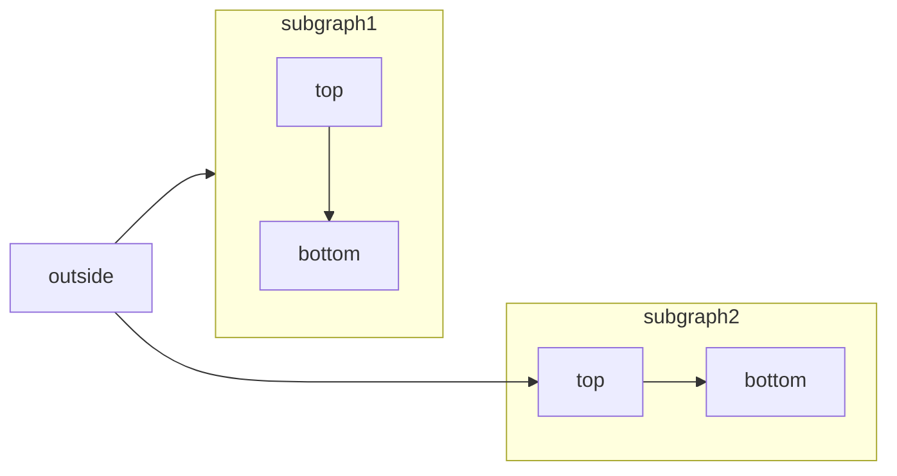
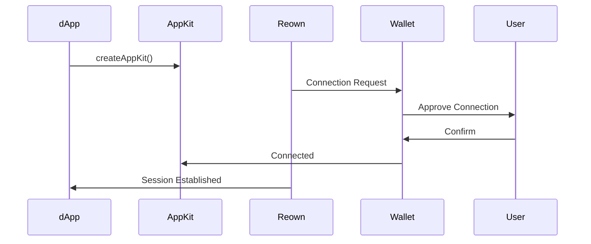

# Reown Documentation Writing Skill

This skill guide defines how to write documentation for Reown products using Mintlify. Follow these guidelines to maintain consistency across all documentation.

## Voice and Tone

### Brand Attribution
- **Always use "Reown"** as the subject when describing capabilities, offerings, or actions.
- **Never use** first-person pronouns like "we", "our", "us", or "my team" when referring to Reown.

| ❌ Incorrect | ✅ Correct |
|-------------|-----------|
| We provide this SDK | Reown provides this SDK |
| Our team built this feature | Reown built this feature |
| The SDK provided by us | The SDK provided by Reown |
| We recommend using... | Reown recommends using... |

### Writing Style
- **Be concise and direct.** Get to the point without unnecessary preamble.
- **Avoid vague language.** Replace words like "stuff", "things", "various", "etc." with specific terms.
- **Use active voice** wherever possible.
- **Write for a technical audience** but remain accessible.

| ❌ Vague | ✅ Specific |
|---------|-----------|
| The SDK does various things | The SDK handles wallet connections, transaction signing, and authentication |
| Set up some configuration stuff | Configure the project ID, metadata, and network settings |
| There are several options available | Three adapter options are available: Wagmi, Ethers, and Solana |

## Document Structure

### Page Frontmatter (Required)
Every `.mdx` file must begin with frontmatter for SEO and navigation. **Do not use H1 (`#`) for the page title**, it is automatically generated from the frontmatter.

```mdx
---
title: "Reown AppKit"
description: "Overview of Reown AppKit, a comprehensive SDK for creating seamless onchain UX with wallet connections, authentication, and multi-chain support."
sidebarTitle: "Overview"
---
```

#### Frontmatter Fields
| Field | Required | Guidelines |
|-------|----------|------------|
| `title` | Yes | The full page title. Displayed at the top of the page and used for SEO. |
| `description` | Yes | A short, concise summary (1-2 sentences). Used for SEO meta description. |
| `sidebarTitle` | Recommended | A simple, use-case-driven label for the sidebar. **Avoid technical jargon.** |

**sidebarTitle examples:**

| ❌ Incorrect | ✅ Correct |
|-------------|-----------|
| React SDK Implementation Guide | React |
| Reown API Reference v2.0 | API Reference |
| EIP-155 Chain Configuration | Supported Networks |

### Heading Hierarchy
- **Never use H1 (`#`)** in the body. The title comes from frontmatter.
- **H2 (`##`)**: Major sections.
- **H3 (`###`)**: Subsections within H2 sections.
- **H4 (`####`)**: Subsections within H3 sections (use sparingly).
- **Never use bold text as a substitute for headings.**

## Mintlify Components

### Callouts

Use callouts to style and emphasize important content. Available types:

```mdx
<Note>This adds a note in the content</Note>
```

```mdx
<Warning>This raises a warning to watch out for</Warning>
```

```mdx
<Info>This draws attention to important information</Info>
```

```mdx
<Tip>This suggests a helpful tip</Tip>
```

```mdx
<Check>This brings us a checked status</Check>
```

```mdx
<Danger>This is a danger callout</Danger>
```

You can also create custom callouts with icons:

```mdx
<Callout icon="key" color="#FFC107" iconType="regular">This is a custom callout</Callout>
```

**When to use each:**
| Type | Use Case |
|------|----------|
| `<Note>` | General supplementary information |
| `<Warning>` | Breaking changes, deprecations, things to watch out for |
| `<Info>` | Important context or clarification |
| `<Tip>` | Best practices, recommendations |
| `<Check>` | Success states, completed steps |
| `<Danger>` | Critical warnings, potential data loss, security concerns |

### Steps

Use `<Steps>` to display a series of sequential actions or events. **Recommended for high-level/conceptual pages.** Can also be used in technical docs when relevant.

```mdx
<Steps>
  <Step title="First Step">
    These are instructions or content that only pertain to the first step.
  </Step>
  <Step title="Second Step">
    These are instructions or content that only pertain to the second step.
  </Step>
  <Step title="Third Step">
    These are instructions or content that only pertain to the third step.
  </Step>
</Steps>
```

**Step properties:**
| Property | Type | Description |
|----------|------|-------------|
| `title` | string | Required. The title shown next to the step indicator. |
| `icon` | string | Optional. Font Awesome or Lucide icon name. |
| `stepNumber` | number | Optional. Override the step number. |

### Cards and Columns (CTAs)

Use `<Columns>` to group multiple `<Card>` components in a grid. **Prefer `cols={2}` for better appearance.**

```mdx
<Columns cols={2}>
  <Card title="Get started">
    Set up your project with our quickstart guide.
  </Card>
  <Card title="API reference">
    Explore endpoints, parameters, and examples for your API.
  </Card>
</Columns>
```

**Columns properties:**
| Property | Type | Default | Description |
|----------|------|---------|-------------|
| `cols` | number | 2 | Number of columns per row. Accepts values from 1 to 4. |

### Code Groups

Use `<CodeGroup>` to display multiple code blocks in a tabbed interface. **Use when documenting the same logic/feature across different languages, platforms, or blockchain networks.**

Each code block must include a title, which becomes the tab label. The code blocks must be placed **within** the `<CodeGroup>` opening and closing tags.

````mdx
<CodeGroup>
```javascript helloWorld.js
console.log("Hello World");
```

```python hello_world.py
print('Hello World!')
```

```java HelloWorld.java
class HelloWorld {
    public static void main(String[] args) {
        System.out.println("Hello, World!");
    }
}
```
</CodeGroup>
````

You can also use a dropdown menu instead of tabs with the `dropdown` prop:

````mdx
<CodeGroup dropdown>
```javascript helloWorld.js
console.log("Hello World");
```

```python hello_world.py
print('Hello World!')
```
</CodeGroup>
````

### Accordions (FAQs)

Use `<Accordion>` for expandable/collapsible content. **Always use `<AccordionGroup>` to group related accordions together for FAQ sections.**

**Single Accordion:**

```mdx
<Accordion title="I am an Accordion.">
  You can put any content in here, including other components.
</Accordion>
```

**Accordion Group (for FAQs):**

```mdx
<AccordionGroup>
  <Accordion title="What networks does Reown AppKit support?">
    Reown AppKit supports EVM chains, Solana, and Bitcoin networks.
  </Accordion>

  <Accordion title="How do I obtain a project ID?">
    Head over to Reown Dashboard and create a new project to obtain your project ID.
  </Accordion>

  <Accordion title="Troubleshooting">
    Keep related content organized into groups.
  </Accordion>
</AccordionGroup>
```

**Accordion properties:**
| Property | Type | Description |
|----------|------|-------------|
| `title` | string | Required. Title in the Accordion preview. |
| `description` | string | Optional. Detail below the title in the Accordion preview. |
| `defaultOpen` | boolean | Optional. Whether the Accordion is open by default (default: false). |
| `icon` | string | Optional. Font Awesome or Lucide icon name. |

### Mermaid Diagrams

Use Mermaid to build flowcharts, sequence diagrams, Gantt charts, and other diagrams using text and code. **Include Mermaid diagrams in technical docs when explaining multi-step flows, architecture, or SDK workflows.**

To create a Mermaid diagram, write your diagram definition inside a Mermaid code block:



**When to use diagrams:**
- Wallet connection flows
- SDK initialization and configuration flows
- Architecture overviews
- Multi-step API interactions

For a complete list of supported diagram types and syntax, see the [Mermaid documentation](https://mermaid.js.org/intro/).

## Page Templates

### Overview/Conceptual Page (Non-Technical)

```mdx
---
title: "Reown AppKit"
description: "A comprehensive SDK for creating seamless onchain UX."
sidebarTitle: "Overview"
---

[Brief introduction - 1-2 paragraphs explaining what this is and why it matters]

## Who is Reown AppKit for?

[Audience segments with descriptions]

## How does Reown AppKit work?

[High-level flow - consider using <Steps> or a Mermaid diagram]

## What does Reown AppKit offer?

[Key benefits or features]

## Get Started

<Columns cols={2}>
  <Card title="For Apps" icon="browser" href="/appkit/overview">
    Integrate Reown AppKit into your dApp.
  </Card>
  <Card title="For Wallets" icon="wallet" href="/walletkit/overview">
    Enable wallet connections with WalletKit.
  </Card>
</Columns>
```

### Technical/SDK Documentation Page

````mdx
---
title: "Reown AppKit - React Installation"
description: "Integrate Reown AppKit into your React application."
sidebarTitle: "React"
---

[One-line description of what this enables]

<Warning>
Important notice about prerequisites or upcoming changes.
</Warning>

## Requirements

[Platform versions, dependencies, prerequisites]

## Installation

[Package manager commands with code blocks]

## Configuration

[Initialization code with explanation]

### Configuration Parameters

| Parameter | Type | Required | Description |
|-----------|------|----------|-------------|
| `projectId` | `String` | Yes | Your Reown project ID from the Dashboard |

## Connection Flow

[Include a Mermaid diagram for multi-step flows]



<Steps>
  <Step title="Install the Package">
    Code and explanation for step 1.
  </Step>
  <Step title="Configure AppKit">
    Code and explanation for step 2.
  </Step>
</Steps>

## Complete Example

[Full working code example]

## Error Handling

[Error types in a table]

## API Reference

[Methods and data types in tables]

## Troubleshooting

[Common issues and solutions]

## Frequently Asked Questions

<AccordionGroup>
  <Accordion title="Common question 1?">
    Answer to question 1.
  </Accordion>
</AccordionGroup>
````

---

## Code Guidelines

### Code Blocks
- **Always specify the language** for syntax highlighting.
- **Include a title** for the code block (becomes the filename display).
- **Keep code focused**. Show only relevant code.
- **Add comments** to explain non-obvious parts.
- **Use realistic placeholder values** (`"YOUR_PROJECT_ID"`, not `"abc123"`).

```typescript Installation
npm install @reown/appkit
```

### Tables
Use tables for:
- Configuration parameters (Parameter | Type | Required | Description)
- Error codes and descriptions
- Supported networks/chains
- API method references

## Quality Checklist

Before publishing, verify:

- [ ] Frontmatter includes `title`, `description`, and `sidebarTitle`
- [ ] `sidebarTitle` is simple and jargon-free
- [ ] No H1 (`#`) in the body. The title comes from frontmatter
- [ ] All sections use proper heading hierarchy (H2, H3, H4)
- [ ] No bold text used as headings
- [ ] No first-person pronouns (we, our, us) referring to Reown
- [ ] "Reown" used for brand attribution
- [ ] Code blocks have language and title specified
- [ ] `<CodeGroup>` used for multi-platform/multi-language examples
- [ ] `<Steps>` used for sequential processes
- [ ] `<AccordionGroup>` used for FAQs
- [ ] `<Columns cols={2}>` with `<Card>` used for CTAs
- [ ] Mermaid diagrams included for complex flows (technical docs)
- [ ] Callouts use appropriate types (`<Note>`, `<Warning>`, `<Tip>`, etc.)
- [ ] Prerequisites listed before installation
- [ ] Page ends with clear next steps or CTAs