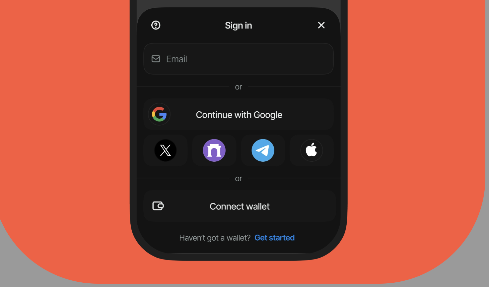

import Container from '../components/Container.js'
import Wrapper from '../components/Home/Wrapper.js'
import Button from '../components/button/index.js'
import W3MQuickStart from '../components/W3MQuickStart.js'

import reactLogo from '../../static/assets/home/reactLogo.png'
import nextjsLogo from '../../static/assets/home/nextjsLogo.png'
import htmlLogo from '../../static/assets/home/htmlLogo.png'
import vueLogo from '../../static/assets/home/vueLogo.png'
import androidLogo from '../../static/assets/home/androidLogo.png'
import iosLogo from '../../static/assets/home/iosLogo.png'
import rnLogo from '../../static/assets/home/rnLogo.png'
import flutterLogo from '../../static/assets/home/flutterLogo.png'
import unityLogo from '../../static/assets/home/unityLogo.png'
import javascriptLogo from '../../static/assets/home/javascriptLogo.png'

# AppKit

Reown AppKit is a powerful, free, and fully open-source solution for developers looking to integrate wallet connections and other Web3 functionalities into their apps on any EVM and non-EVM chain. In just a few simple steps, you can provide your users with seamless wallet access, one-click authentication, social logins, and notifications—streamlining their experience while enabling advanced features like on-ramp functionality and smart accounts. 

Reown AppKit is open-source and free to use, which provides flexibility, transparency, and efficiency in building Web3 applications.

### Demo
<Button name="Try Demo" url="https://appkit-lab.reown.com/" />
 

**Ready to get started? Check out the Quickstart section [here](#quickstart). Learn more about all the features AppKit offers [here](#features).**

{/* <W3MQuickStart /> */}

## Quickstart

<Wrapper
  type="large"
  fit={false}
  items={[
    {
      name: 'React',
      type: 'react',
      description: 'Get started with AppKit in React.',
      icon: reactLogo,
      href: './react/core/installation'
    },
    {
      name: 'Next.js',
      type: 'next',
      description: 'Get started with AppKit in Next.js.',
      icon: nextjsLogo,
      href: './next/core/installation',
      isWhite: true
    },
    {
      name: 'Vue',
      type: 'vue',
      description: 'Get started with AppKit in Vue.',
      icon: vueLogo,
      href: './vue/core/installation'
    },
    {
      name: 'JavaScript',
      type: 'javascript',
      description: 'Get started with AppKit in JavaScript.',
      icon: javascriptLogo,
      href: './javascript/core/installation'
    },
    {
      name: 'React Native',
      type: 'react-native',
      description: 'Get started with AppKit in React Native.',
      icon: rnLogo,
      href: './react-native/core/installation'
    },
    {
      name: 'Flutter',
      type: 'flutter',
      description: 'Get started with AppKit in Flutter.',
      icon: flutterLogo,
      href: './flutter/core/installation'
    },
    {
      name: 'Android',
      type: 'android',
      description: 'Get started with AppKit in Android.',
      icon: androidLogo,
      href: './android/core/installation'
    },
    {
      name: 'iOS',
      type: 'ios',
      description: 'Get started with AppKit in iOS.',
      icon: iosLogo,
      href: './ios/core/installation',
      isWhite: true
    },
    {
      name: 'Unity',
      type: 'unity',
      description: 'Get started with AppKit in Unity.',
      icon: unityLogo,
      href: './unity/core/installation',
      isWhite: true
    }
  ]}
/>

## Features

#### Framework Agnostic
Integrate effortlessly with popular frameworks like React, Vue, Svelte, vanilla JavaScript, and more.

#### EIP-6963 Support
Seamlessly connect browser extension wallets for an enhanced user experience. Learn more about **EIP-6963 [here](https://eips.ethereum.org/EIPS/eip-6963).**

#### Email Wallets
Enable users to connect to dapps using just their email address, ensuring a smooth onboarding process.

#### On-Ramp
Allow users to securely purchase crypto with fiat, directly within your app, supporting over 100 cryptocurrencies.

#### Customizable UI
Choose between light and dark modes, accent colors, or fully customize the interface with your own branding.

#### Multi-Chain Ready
Easily configure support for EVM and non-EVM chains, giving users access to multiple blockchain networks.

#### Hundreds of Wallets
Connect with popular wallets like MetaMask, Rainbow, Coinbase, and many more to maximize accessibility.

#### Transaction History
Display all user transactions directly in the account view for added transparency.

#### Transaction History
Display a comprehensive list of all user transactions directly in the account view.

#### Swaps
Simplify token swapping for users with AppKit Modal, allowing secure, in-app swaps with just one line of code.

#### Email & Social Login
Expand your app’s reach by enabling users to connect using their email or social accounts. Implement these features with minimal code and leverage Smart Account functionality for advanced capabilities.

#### One-Click Auth
Streamline user authentication with WalletConnect v2 integration. Users can sign in and connect to your app with just one tap, supporting multi-chain and multi-account signing.

#### Smart Accounts
Enhance security and user convenience with features like multi-signature authorization and automated transaction workflows.

#### Solana Support
Bring the Solana blockchain to your application with simple, secure wallet connections and seamless transaction support.

#### Notifications
Engage your users with web3-native notifications sent straight to their wallets or through in-app and Web3Inbox notifications.

#### Telegram MiniApps
Build Web3 mini-apps for Telegram with a prebuilt interface for connecting self-custodial wallets or enabling wallet creation via email or social login.